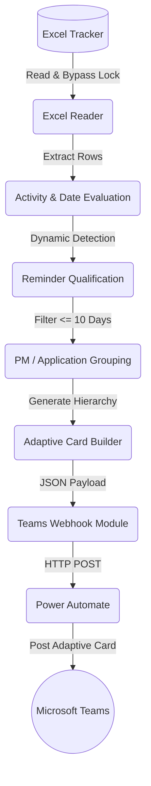

# MS Teams Automation: Access Request Reminders

> **Automated Microsoft Teams access-request reminders driven by Excel deadlines, dynamic activity tracking, Adaptive Cards, and responsible-PM mentions.**


---

## Overview

The **MS Teams Access Request Automation** project bridges the gap between project management trackers in Excel and actionable, real-time communications in Microsoft Teams. 

When managing multiple software applications, tracking access requests and release activities (such as `QA R-Task`, `Dev OUR`, and `Prod Service Request`) can become overwhelming. This project automatically reads a master Excel tracker, dynamically identifies pending activities with approaching due dates, and dispatches a consolidated, beautifully formatted Adaptive Card to a Microsoft Teams channel via Power Automate.

### Key Features
- **Excel-based Tracking:** Safely parses data from Excel, automatically bypassing OS and OneDrive file locks.
- **Dynamic Activity Detection:** Scans for any date-bearing columns dynamically—no hardcoded column mapping required!
- **Individual Due-Date Filtering:** Excludes individual pending activities that are more than 10 days away, ensuring teams only focus on immediate priorities.
- **Smart Reminder Windows:** Qualifies applications based on the overall `Start Date` or `End Date` falling within a configurable reminder threshold.
- **Responsible PM @Mentions:** Associates applications directly with the Responsible PM, alerting them via native Teams `@mentions`.
- **Application-Level Separation:** Distinctly separates multiple applications owned by the same PM, providing a clean visual hierarchy.
- **Professional Adaptive Cards:** Renders the notifications using a structured, vertical container layout instead of cluttered tables.
- **Deduplication Engine:** Prevents notification fatigue by tracking previously dispatched alerts via a local state file.
- **Dry-Run Mode:** Validate business logic and preview JSON payloads safely without actually dispatching webhooks.

---

## Architecture

The system operates in a unidirectional flow. A scheduled Python orchestrator analyzes the Excel tracker and forwards the resulting Adaptive Card payload to a Power Automate webhook, which acts as the transport layer to Microsoft Teams.



---

## How It Works

### 1. Excel Input Structure
The application processes a master Excel workbook containing release schedules. It handles empty cells, non-breaking spaces, and unexpected date formats. 

**Example Table Structure:**
| Responsible PM | Email/Teams | Application | Start Date | Overall Status | Dev OUR | Dev OUR Status | QA R-Task | QA R-Task Status |
|---|---|---|---|---|---|---|---|---|
| Alice | alice@example.com | App-Alpha | 24-Aug | In Progress | 14-Aug | Completed | 18-Aug | In Progress |
| Bob | bob@example.com | App-Beta | 21-Aug | Not Started | 17-Aug | Not Started | 22-Aug | Not Started |

**Dynamic Evaluation:** 
Instead of hardcoding "Dev OUR", the script dynamically discovers date-bearing columns. If a column is a date, it checks if a corresponding "Status" column exists. 

### 2. Reminder Logic & Filtering
- **Reminder Window:** The application is only qualified if its `Start Date` or `End Date` is approaching (configured by `REMINDER_DAYS_BEFORE`, default: 2 days).
- **Date Filtering:** Even if the application qualifies, individual activities are evaluated independently. An activity is only included in the final payload if its due date is **≤ 10 days** from today.
- **Consolidation:** All qualified applications are bundled into a single webhook payload, grouped logically by the Responsible PM.
- **Deduplication:** A `.json` state file tracks what was sent to prevent duplicate messages during the same state transition.

### 3. Teams Notification Flow
1. **Python** builds a rich `AdaptiveCard` JSON payload.
2. The payload is `POST`ed to a **Power Automate webhook trigger**.
3. **Power Automate** executes the "Post adaptive card and wait for a response" action in a specified Teams channel.
4. **Microsoft Teams** renders the Adaptive Card, natively parsing `<at>User Name</at>` tags into actual ping notifications.

---

## Project Structure

```text
MS_Teams_Automation/
├── main.py                     # Core orchestrator and execution logic
├── config.py                   # Environment variable loading & setup
├── date_checker.py             # Timezone-aware date parsing & reminder logic
├── excel_reader.py             # Safe Excel extraction (bypasses OneDrive locks)
├── message_builder.py          # Microsoft Teams Adaptive Card JSON builder
├── notification_state.py       # Deduplication & state management
├── teams_webhook.py            # HTTP transport layer for Webhooks
├── test_business_logic.py      # Pytest suite for logic & card structure
├── test_webhook.py             # Pytest suite for webhook transport
├── appDeadlineSample.xlsx      # Sample Excel input file
├── requirements.txt            # Python dependencies
├── .env.example                # Template for environment variables
├── .gitignore                  # Git exclusion rules
└── README.md                   # Project documentation
```

---

## Configuration

Copy the provided `.env.example` file to create your own `.env` configuration file:

```bash
cp .env.example .env
```

**Safe `.env` Example:**
```env
TEAMS_WEBHOOK_URL=https://prod-XX.region.logic.azure.com:443/workflows/...
EXCEL_FILE=appDeadlineSample.xlsx
SHEET_NAME=
DRY_RUN=false
ENABLE_DEDUPLICATION=true
REMINDER_DAYS_BEFORE=2
TIMEZONE=Asia/Kolkata
```

> [!WARNING]  
> **Security:** Never commit your `.env` file to version control. The `.gitignore` file is explicitly configured to prevent this, ensuring your webhook URLs and credentials remain secure.

---

## Installation & Usage

### 1. Install Dependencies
Ensure you have Python 3.7+ installed.
```bash
pip install -r requirements.txt
```

### 2. Running the Automation
Execute the main entry point to process the Excel sheet and send the notification:
```bash
python main.py
```

### 3. Dry Run Mode
Safely evaluate business logic and preview the generated JSON without dispatching a webhook by temporarily overriding the `.env` configuration:

**Windows (PowerShell):**
```powershell
$env:DRY_RUN="true"; python main.py
```
**Linux / Mac:**
```bash
DRY_RUN=true python main.py
```

---

## Testing

The project includes a robust `pytest` suite designed to mathematically verify dynamic date discovery, 10-day activity thresholds, container-based UI generation, and deduplication boundaries.

Run the test suite:
```bash
python -m pytest -q
```

---

## Future Enhancements
- **Interactive Responses:** Upgrading the Power Automate flow to capture interactive button clicks (e.g., "Mark Completed") and using the Microsoft Graph API to write the status directly back into the source Excel file.
- **Multiple Channels:** Supporting routing applications to different Teams channels based on business unit mappings.

---

## Contributing
Contributions, issues, and feature requests are welcome! Ensure that all new features include corresponding `pytest` coverage and do not break the dynamic date-parsing engine.

## License
This project is licensed under the MIT License.
